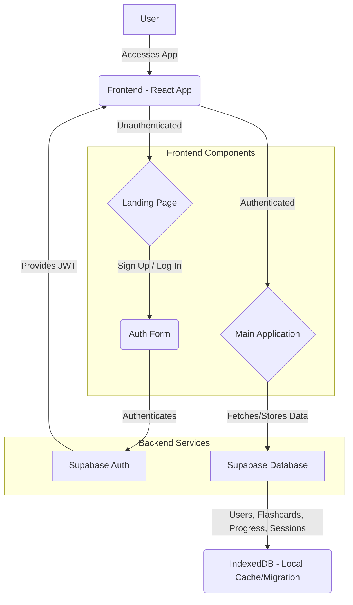

# Future Plan: User Authentication and Landing Page with Supabase

## Goal
Implement a robust user authentication system (signup, login, password reset) and a landing page, integrating with a Supabase backend to store user and activity information.

## High-Level Architectural Diagram

## Detailed Plan of Action

### Phase 1: Setup & Core Authentication

*   **Research Supabase Integration**: Understand Supabase client library setup, authentication methods (email/password, OAuth), and database interaction.
*   **Initialize Supabase Client**: Add Supabase client initialization to the project (e.g., in a new `src/services/supabase.ts` file).
*   **Implement User Authentication Service**: Create `src/services/auth.ts` with functions for `signUp`, `signIn`, `signOut`, `getCurrentUser`.
*   **Implement Password Reset Functionality**: Add a function to `src/services/auth.ts` to initiate a password reset (e.g., `sendPasswordResetEmail`).
*   **Design Supabase Database Schema**:
    *   `profiles` table (linked to `auth.users`): `id (uuid, PK, FK to auth.users.id)`, `username`, `created_at`.
    *   Update existing tables (`flashcards`, `progress`, `sessions`, `settings`) to include a `user_id` (UUID, FK to `profiles.id`) and RLS (Row Level Security) policies.

### Phase 2: Frontend Integration

*   **Create Authentication Context**: Implement a React Context (`src/contexts/AuthContext.tsx`) to manage user session state globally.
*   **Design Landing Page Component**: Create `src/components/auth/LandingPage.tsx` with calls to action for Login/Signup.
*   **Design Auth Form Component**: Create `src/components/auth/AuthForm.tsx` for user signup and login (email/password).
*   **Design Forgot Password Form**: Create a new component or extend `AuthForm.tsx` to include a "Forgot Password" link and a form to request a password reset email.
*   **Design Reset Password Form**: Create a new component for users to enter and confirm a new password after receiving a reset link. This will likely involve handling a specific route (e.g., `/reset-password`).
*   **Implement Protected Routes**: Modify `src/App.tsx` to use React Router (if not already present, or a simple conditional rendering) to show `LandingPage` for unauthenticated users and the main app for authenticated users.
*   **Update Navigation**: Adjust `src/App.tsx` navigation to include Login/Signup/Logout buttons.

### Phase 3: Data Migration & User-Specific Data

*   **Update `DatabaseService`**: Modify `src/services/indexedDB.ts` to handle `user_id` for local data, and potentially synchronize with Supabase.
*   **Implement Data Synchronization Logic**: When a user logs in, check for existing IndexedDB data and offer to migrate it to Supabase.
*   **Modify Flashcard/Progress/Session Logic**: Update `SRSService` and other components to fetch/store data based on the currently authenticated `user_id`.

### Phase 4: Refinements & Edge Cases

*   **Error Handling**: Implement robust error handling for authentication and database operations.
*   **Loading States**: Show loading indicators during auth/data operations.
*   **Session Management**: Handle token refresh, session expiry.
*   **UI/UX Improvements**: Ensure a smooth user flow for signup/login/logout.